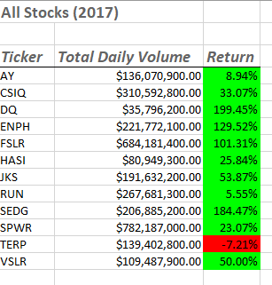
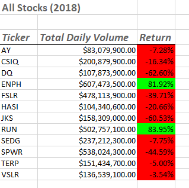
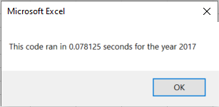
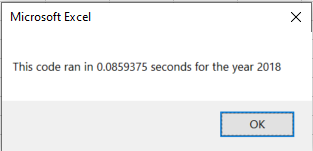

# Stock-analysis

## Project Overview

### Background

Analysis of pricing for individual stocks over time as well as trading volume is a data- and time-intensive task to attempt to perform manually. There are multiple forms of data, and the sheer number of daily trades makes it impractical to perform any sort of manual analysis of a group of stocks over time. 

### Purpose

The purpose of this project was to assist our good friend Steve (side note: if he's fresh out of school himself, how did he earn a a finance degree without these skills? He should obviously enroll in a Data Bootcamp) in presenting his parents with key information on stocks of interest to them (in this case green energy-focused stocks). With 3,000+ rows of data showing daily information for twelve separate companies' stock for both 2017 and 2018, it would be impossible for Steve or his parents to have a good grasp of any optimal investment strategies without further data analysis.

## Results

### Stock Analysis
Previous work in this module has allowed us to develop code that would present the annual information for each of the twelve stocks, particularly the total daily volume of trades, as well as the annual return based on year start and year end prices. The total daily volume provides context on how many trades have been executed over each year. As noted in the module text, a higher volume indicates higher certainty of pricing. The annual return provided for 2017 and 2018 give a history of the performance of each stock (though we all know that as a fiduciary Steve should be very quick to point out to his parents that past performance is not indicative of future returns). 

The following two images demonstrate the output from running the analysis for all stocks by year for 2017 and 2018, as we developed for the asynchronous module course work:





While the 2017 analysis indicated all but one stock provided a positive return on investment, the 2018 analysis demonstrated a sharp decrease in returns for all but two of the stocks. Analysis of those two high-performers, ENPH and RUN, for both 2017 and 2018 should be done in more detail to investigate as safe and potentially profitable investments in green energy.

### Code Refactoring
The code we wrote in the module for Steve prior to initiating the Challenge was effective, but took over half a second to run for each year. This intial code only looped through starting price and ending price, as well as the daily trading volume per stock and required looping through all 3013 rows to retrieve the specified data. The loop through all the rows for all twelve tickers looked like the following:
```
For i = 0 To 11
   ticker = tickers(i)
   totalVolume = 0
    Worksheets("2018").Activate
    
    For j = 2 To RowCount
        If Cells(j, 1).Value = ticker Then         
            totalVolume = totalVolume + Cells(j, 8).Value       
        End If
        
        If Cells(j - 1, 1).Value <> ticker And Cells(j, 1).Value = ticker Then
            startingPrice = Cells(j, 6).Value
        End If
        
        If Cells(j + 1, 1).Value <> ticker And Cells(j, 1).Value = ticker Then
            endingPrice = Cells(j, 6).Value
        End If
        
    Next j

Next i
```
While effective, it certainly would become burdensome from a time perspective if we were analyzing more than twelve stocks. 

The refactored code introduced the use of additional output arrays, 'tickerVolumes(12)', 'tickerStartingPrices(12)', and 'tickerEndingPrices(12)' that allowed the subroutine to loop through the rows only looking for each particular ticker and assembling the total volume per ticker instead of having to run through the entire loop in the array individually. The if statements could then be run to find the starting and ending prices as before, utilizing the arrays to only loop through the rows for each individual ticker instead of all rows, again speeding up the process. The code to loop through the rows, for for initializing the tickerVolumes to zero and then to loop through the entire spreadsheet utilizing the arrays was as follows:

```
 For i = 0 To 11
        
        tickerIndex = i        
        tickerVolumes(tickerIndex) = 0
    
    Next i    
           
    tickerIndex = 0
    
    For i = 2 To RowCount
               
        tickerVolumes(tickerIndex) = tickerVolumes(tickerIndex) + Cells(i, 8).Value
                     
        If Cells(i - 1, 1).Value <> tickers(tickerIndex) And Cells(i, 1) = tickers(tickerIndex) Then
            
            tickerStartingPrices(tickerIndex) = Cells(i, 6).Value
            
        End If
        
        If Cells(i + 1, 1).Value <> tickers(tickerIndex) And Cells(i, 1) = tickers(tickerIndex) Then
            
            tickerEndingPrices(tickerIndex) = Cells(i, 6).Value

            tickerIndex = tickerIndex + 1
            
        End If    
        
    Next i
```
The resulting runs of the refactored code let do significant decreases in runtime, as seen below for the 2017 and 2018 refactored stock analysis runs:





## Summary/Conclusions
### What are the advantages and disadvantages of refactoring code in general?
By removing the nested loop through the use of additional arrays, the refactored code was able to run much quicker and with greater efficiency. This can allow for the analysis of much larger datasets than presented at this time, and also lead to quicker bug discovery/resolution since there is less time to wait between runs to see if any bug has been resolved. Potential drawbacks to refactoring code produced by another include the risk of mixing methodologies, that though they work at the time, may come in conflict with additional code additions in the future. Documentation and justification for different methods can also become burdensome. There certainly is also a "if it ain't broke, don't fix it" ethos to be observed when we have code that runs in sufficient time for the current project needs.

### What were the advantages and disadvantages of refactoring the original VBA script specific to this project?
The advantage of refactoring the code in this VBA script was the removal of the nested loop so each step of the subroutine had to roll through a reduced number of rows to return the proper information. This decreased the runtime and ensured the optimization of the script should it be applied to a larger number of stocks in the future. A particular disadvantage to refactoring the code was that it was INCREDIBLY time-consuming to figure out how to follow the instructions for this challenge to get the refactored code to properly work while using the arrays, while QC'ing the work to ensure the output values were not compromised.
